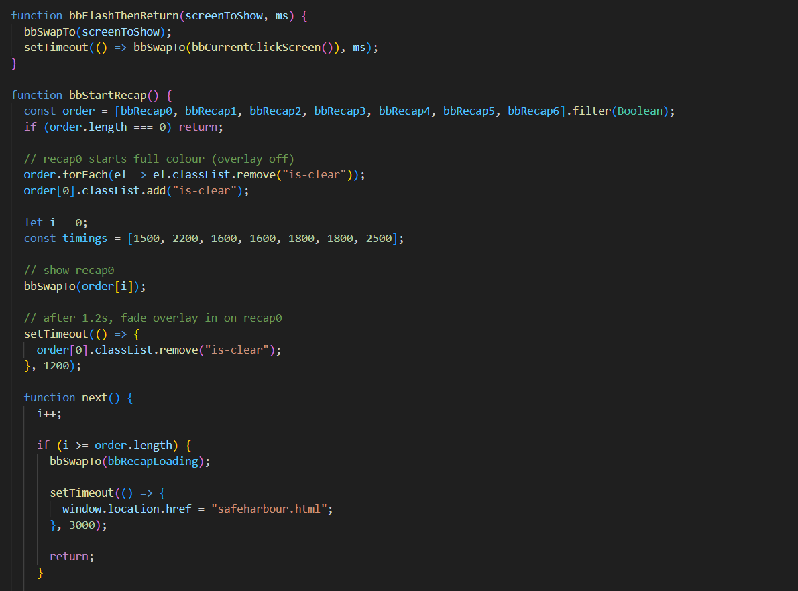
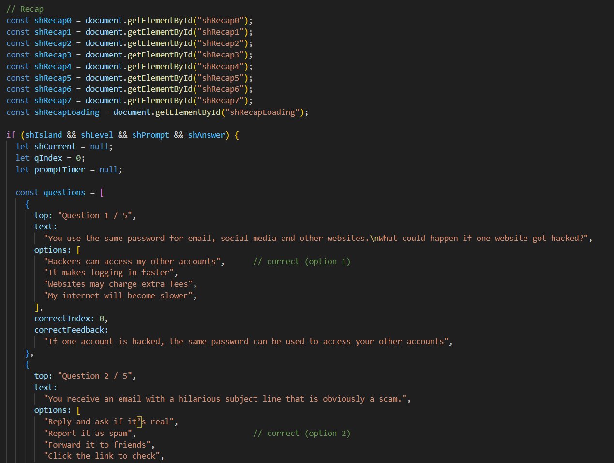
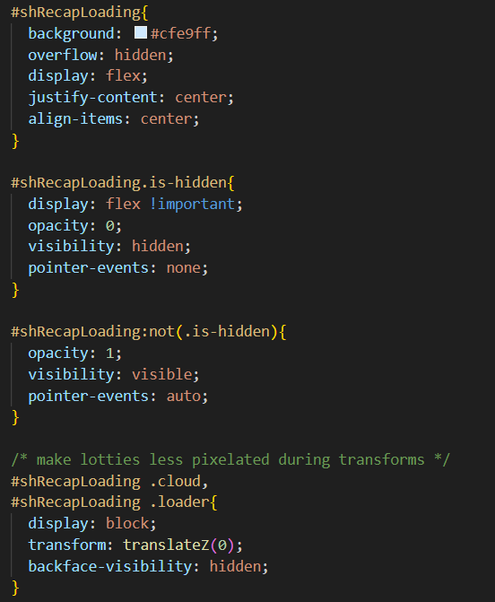

# SilverIsle-IP
Interactive Development Integrated Project

github link : https://github.com/sheryn7/SilverIsle-IP
github page : https://sheryn7.github.io/SilverIsle-IP/

# SilverIsle

**Project Overview**
SilverIsle is an interactive web experience where users explore island-based zones to practise everyday digital skills. Instead of reading instructions, users learn by doing through guided actions, feedback and steady progression.

From the start, users are invited into a small island world with a reward waiting at the end. As they complete tasks and move through each island, they unlock their final treasure, a certificate that recognises their progress. SilverIsle turns digital learning into a journey that feels approachable, encouraging and open to both younger and older users.

**Design Process**
The design process for SilverIsle began with identifying a common challenge across generations which is how many people, especially the elderly and youths, feel uncertain or anxious when using digital tools hence we made a digital literacy web tool to help these users.

Rather than designing a traditional learning platform with long explanations, the project focuses on learning through guided interaction. The experience is structured around simple actions, clear feedback and gradual progression across island-based zones. The goal was to create a calm and approachable environment that reduces pressure while still maintaining engagement.

Users want to:
• Feel more confident using digital tools
• Understand how to stay safe online
• Practise real-world digital actions in a low-pressure environment
• Complete something meaningful and feel a sense of progress

SilverIsle supports these goals by:
• Breaking learning into small, manageable tasks
• Providing immediate visual and text feedback
• Allowing safe retry without penalties
• Using an island-based structure to create a sense of journey
• Offering a final certificate as symbolic recognition of progress

User Stories
• As an elderly beginner, I want to practise basic digital actions step by step, so that I can feel more confident using my device.
• As a user new to online safety, I want to try real-life scam scenarios, so that I can recognise suspicious messages in the future.
• As a cautious learner, I want to retry tasks without penalties, so that I can learn without feeling embarrassed or pressured.
• As a progress-driven user, I want to see clear completion milestones, so that I feel a sense of accomplishment.
• As a value-oriented user, I want to receive a certificate at the end of the journey, so that I know my effort has led to meaningful learning.
• As a self-paced learner, I want to explore islands at my own speed, so that I do not feel rushed or overwhelmed.
• As a younger user, I want interactive and engaging activities, so that learning about digital safety does not feel boring.

<ins>Design Process Material</ins>
Figma Wireframe link: https://www.figma.com/design/L29aALRt2waYLflJebKKKy/Apps-Project?node-id=1-2&t=jN9MPEJJ9HfeaHuL-1

**Features**
I implemented 9 features:

Feature 1 – Animated Landing Experience
Introduces users to SilverIsle through a splash screen, animated logo sequence and background visuals which creates an engaging and welcoming first impression.

Feature 2 – Interactive Island Navigation
Allows users to visually explore different learning islands (Basics Bay and Safe Harbour) and guiding them through structured digital literacy modules.

Feature 3 – 3D Island Visualisation
Uses interactive 3D models (model-viewer) to represent each island which help users better visualise the learning environment and making the experience more immersive.

Feature 4 – Basics Bay Interactive Module
Allows users to practise fundamental digital skills (e.g. clicking buttons) through guided interaction and instant feedback.

Feature 5 – Safe Harbour Quiz System
Presents users with scenario-based multiple-choice questions that test their understanding of online safety concepts.

Feature 6 – Immediate Feedback System
Provides “Well Done” or “Try Again” responses with animations and explanations, reinforcing learning in real-time.

Feature 7 – Progressive Recap Screens
Summarises key learning points step-by-step using checklist animations, helping users consolidate what they have learned.

Feature 8 – Reward & Certificate System
Awards users a completion certificate after finishing all islands, reinforcing achievement and motivation.

Feature 9 – Customisable Certificate
Allows users to input their name on a generated digital certificate, creating a personalised sense of accomplishment.

<ins>Features Left to Implement</ins>
Feature 1 – User Account System
Implement user authentication and progress saving, allowing learners to resume their journey across sessions.

Feature 2 – Additional practices for each island
Implementing more rounds of praactice for the clicking of button, typing on keyboard, sending messages, answer and end calls and more qna for Safe Harbour.

Feature 3 – Additional Learning Islands
Expand SilverIsle with more themed islands covering topics such as online banking safety, social media awareness and scam detection.

Feature 4 – Real Certificate Download (PDF Export)
Enable users to download their personalised certificate as a PDF file for sharing or printing.

Feature 5 – Background Music with Mute Control
Plays continuous background music throughout the experience, with an optional mute/unmute toggle for accessibility and user preference.

Feature 6 – Audio Narration Support
Supports audio narration for guided learning, making the platform more accessible for users who prefer auditory instructions.

**Technologies Used**
HTML
Used to build the structure of all the webpages.

CSS
Used to style the website, create layouts, colours, responsiveness, and component designs.

JavaScript
Used to add interactivity, such as toggles, accordions, pop-ups, and form validation.

Font Awesome
Used for consistent and scalable icons in the navigation bar, footer, and feature sections.

Google Fonts
Used to apply the Montserrat typeface to give the site a clean, modern look.

Figma
Used to design the wireframes and plan layouts before building the website.

Adobe Illustrator
Used to draw and export original graphics such as icons and product edits.

Lottie
Immersive animations to make website visually nicer.

GitHub Pages
Used to host and deploy the final website online.

ChatGPT
Used as a collaborative tool to assist with debugging, layout troubleshooting, code explanation, and rewriting documentation.
All final design decisions, code implementation, and assets were created by me, with ChatGPT helping to clarify concepts and speed up problem-solving.

**Assistive AI**
1. JS: ChatGPT was used to help with the implementation of the animations and recap sections.

2. CSS: ChatGPT was used to help make the Lotties not pixelated.

**Testing**
<ins>Landing Page (index.html) – Intro + Homepage Flow<ins>

1. Load website from index.html.

2. Splash screen appears (logo + “FlowState Studios” + “Presents to you” + wordmark).

3. Wait for splash to fade into the loading screen.

4. “Welcome to SilverIsle” appears, then transitions into the tagline text.

5. Main homepage appears after loading:

6. Island scene is visible

7. 3D mascot model loads and renders correctly

8. Cloud/background assets show properly

<ins>Bugs / Issues Discovered<ins>

1. 3D models sometimes fail to load on first run (especially after edits). Restarting VS Code / hard refresh resolves it.

2. Some Lottie animations looked pixelated during transitions. Fix applied by keeping the loader mounted (opacity/visibility) + using translateZ(0) and backface-visibility: hidden.

<ins>Credit<ins>
Lottie animations used in this project were sourced from LottieFiles and are used in accordance with their respective licenses.

- Cloud Animation 
- Trophy Animation
- Loader Animation 
- Correct/Success Animation
- Error Animation

<ins>Media</ins>
The photos in my images file under this folder is made by me using Maya and Adobe Illustrator.

<ins>Acknowledgements</ins>
I received inspiration for the layout of this project from Google Interland and Duolingo.